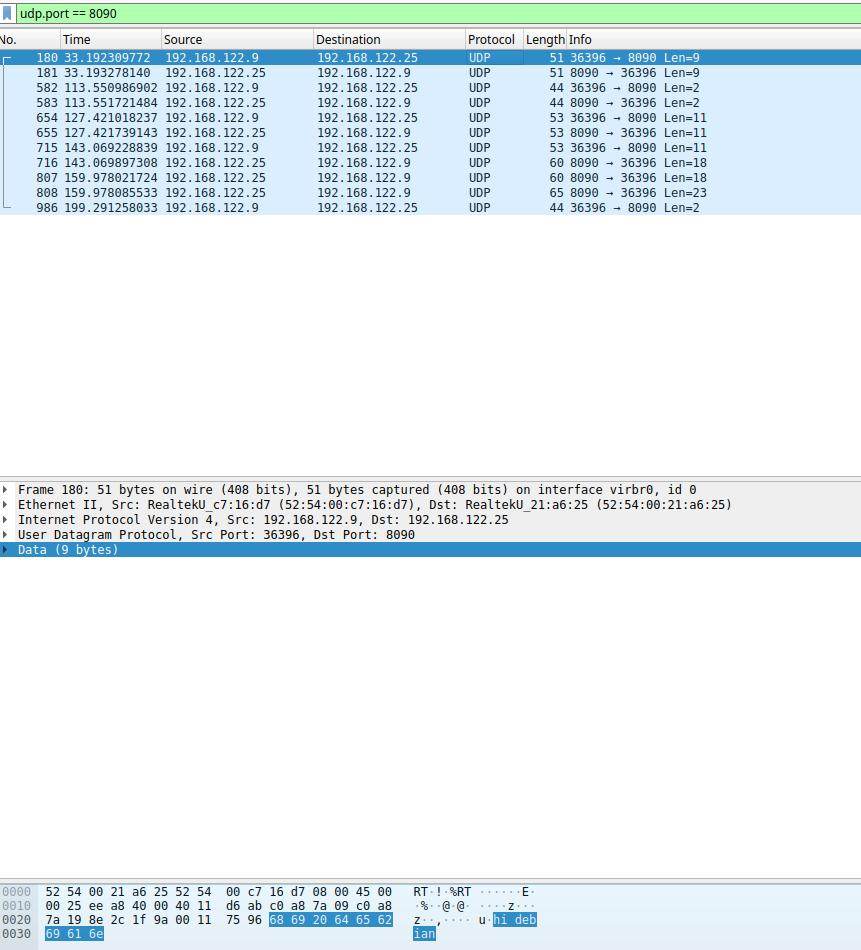

# IaS - Exercise sheet 3

## Task 1 - TCP Chat
The idea is to have a driver code *tcp_chat_launcher.py* that allows to start the application as a server or client, depending on the number of arguments given. For the server, only the port number is needed, for the client also the server's ip address is needed.

In the tcp_chat package ([TestPyPi](https://test.pypi.org/project/tcp-chat-tobi-ruben/)) we have two methods, one for initializing a server peer, which listens for a client initially, and the other for the client, which connects to the listening peer.
If the *launch_client* method doesn't receive the correct parameters and the socket, trying to connect to the server, throws an error, it would be catched and a server would be launched instead.
Once the connection is established the *run_chat* method is responsible for updating sockets (with `select()`), request data from socket and check if connection is still there (otherwise close connection), receive data and send data if something is typed in the standard input.

To close the connection, enter `:q` as a message.

## Task 2/3 - UDP Chat
The idea is to have a driver code, like in the tcp-chat, *udp_chat_launcher.py* that allows to start either the central server unit, or a new client peer. If you run the launcher passing only the port, the server will be initialized, if you pass the server's ip address and port as arguments a new client will be connected to the server.

The udp_chat package ([TestPyPi](https://test.pypi.org/project/udp-chat-tobi-ruben/)) contains two files, one for the client and one for the server side.
Once you start a server, this will listen to all new peers and add them into the user dictionary, which acts as an adress book {username: client addr}.
When you are connected to the server, you can request a userlist, a roomlist, you can connect to a peer/user, you can join a room or create one.

### Table of client commands
| **Commands** | **Arguments** |                    **Meaning**                   |
|:------------:|:-------------:|:------------------------------------------------:|
| poke         | username      | connect to that username (like private messages) |
| kick         | -             | kick all peers from room                         |
| roomlist     | -             | get a list with the avaiable rooms               |
| userlist     | -             | get a list with the avaiable users               |
| roomcreate   | roomname      | create a new room with the name roomname         |
| roomjoin     | roomname      | join a room (like group chat)                    |
| roomleave    | -             | leave actual room you are in                     |

In order to run this commands, just prepend `$` to the command (ex. `$userlist`).

### Task 3b)
With the command: `$userlist` you get the list of participants. It would be implemented in the "network" level, because you are routing some datagrams from a source to a destination.

## Task 4 - Network Analysis
### a)

### b)
**TCP**: Initialising the two peers you first see a *SYN* message, that initiates and establishes the connection, followed by an *ACK* message, that confirms to the other side that it has received the *SYN*. The *SYN, ACK* is a *SYN* from local device, and *ACK* of the earlier packet. In the end, when the peers terminate the communication, the *FIN* message is sent. All this messages belong to the transport/nework level. The data are processed, but not needed to be sent to the application level.
You can see for the chat messages the flag *PSH*, that means "pushing". It refers to the fact that the messages are pushed directly from or to the buffer (depending if it's receiver or sender side) and than to the Application level, without waiting for additional data. This packets are sent to the application level, so that the different clients can read messages and send back some others.

**UDP**: No handshaking between UDP sender-receiver! All the sent packeges are transmitted from the network, to the transport and the application level. The packages captured by wireshark with a datagram like "ul, rl, ..." are than handled by the application level with an intern protocol. The normal messages are displayed in the chat application as in the tcp-chat.

The packages begin with the header segment, similar in the style, but not always the same, and in the end is the data segment. You can also see how the datas are splitted (ex. "hi fro m alpine" sent in the tcp example). In addition, in tcp a line feed is appent to the message.
